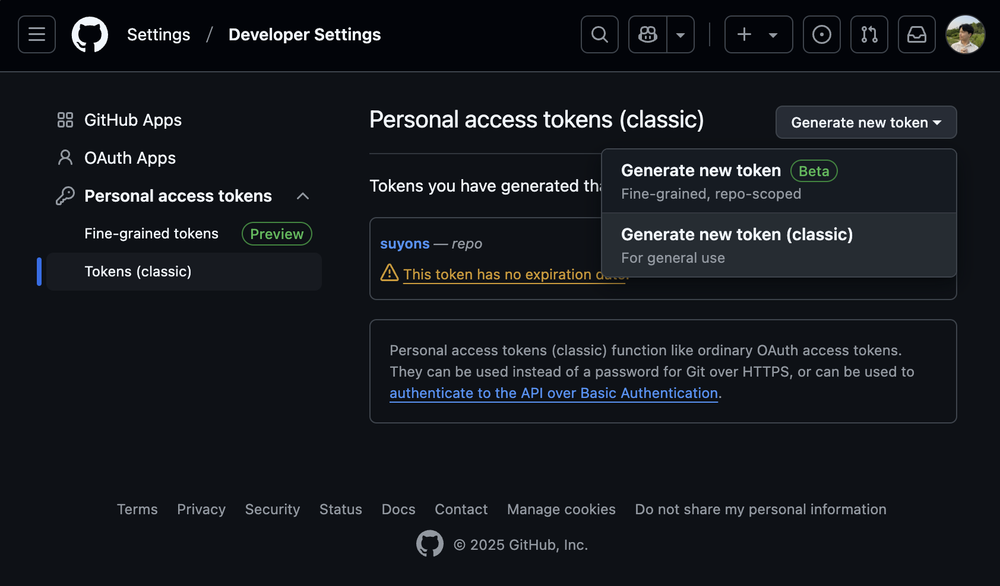

# 가장 간단한 CI/CD: bash 쉘로 next.js 프로젝트 CI/CD 구축하기

# 들어가며

## 요약

1. AWS EC2 인스턴스에서 웹훅 서버를 설정했습니다.
2. GitHub Repository에 push 이벤트가 발생하면 웹훅 URL로 POST 요청을 보냅니다.
3. 웹훅 서버가 POST 요청을 받으면 지정된 스크립트를 실행합니다.
4. 스크립트는 `git pull` -> `npm run build` -> `pm2 reload` 이렇게 구성되어 있습니다.

## 이걸 왜 해야 하나요?

1. AWS EC2 인스턴스 중 t2.micro는 프리 티어 사용자에게 무료로 제공됩니다.
2. 그러나 이는 vCPU 1개, 메모리 1GB로 성능이 매우 낮습니다.
3. 이러한 인스턴스에서 CI/CD를 위해 Jenkins와 같은 도구를 이용하기에는 무리가 있습니다.
4. "무중단 자동 배포"라는 목적만 달성하기 위해 bash 쉘 스크립트를 이용해 CI/CD를 구축해보겠습니다.
5. Vercel을 쓰면 간단히 해결되지만, 회사에서 Vercel을 이용하지 않다 보니 이런 방법을 찾게 되었습니다.

# 필요 패키지 준비

## webhook

### 소개

- 웹훅 서버를 구축할 수 있는 패키지입니다.
- 웹훅 서버는 POST 요청을 받으면 지정된 스크립트를 실행합니다.

### GitHub Repository

https://github.com/adnanh/webhook

### 설치 명령어

```
apt install webhook
```

## pm2

### 소개

- Node.js 프로세스 관리자입니다.
- 프로세스를 관리하고, 로그를 확인하며, 프로세스가 죽으면 다시 실행합니다.

### 설치 명령어

```
npm install pm2 -g
```

# 기존 next.js 프로젝트를 EC2 인스턴스로 가져오기

## GitHub 토큰 발급

1. GitHub: Settings -> Developer settings -> Personal access tokens -> Generate new token (classic)



2. 토큰의 만료 기간은 `No Expiration`으로 설정하고, scope는 `repo`를 선택합니다.


## 레포지토리 클론

1. EC2 인스턴스에 SSH 접속합니다.

```
ssh ubuntu@12.34.56.78 -i your-key.pem
```

2. 로컬 PC에서 작업하던 next.js 프로젝트 레포지토리를 클론합니다.

```
git clone https://<username>:<token>@github.com/<username>/<repository>
```

3. 저의 경우에는 다음과 같이 프로젝트 폴더가 구성되었습니다.


4. 3번의 사진에서 `deploy` 폴더와 `run.sh` 스크립트는 제가 추가한 것입니다.

## 빌드 및 실행 스크립트 작성

### deploy/hooks.json

- webhook이 POST 요청을 수신하면 실행할 작업을 정의합니다.

```json
[
  {
    "id": "rebuild",
    "execute-command": "rebuild.sh",
    "command-working-directory": "/home/ubuntu/my-nextjs-project/deploy",
    "response-message": "push event received",
    "trigger-rule": {
      "match": {
        "type": "value",
        "value": "refs/heads/master",
        "parameter": {
          "source": "payload",
          "name": "ref"
        }
      }
    }
  }
]
```

### deploy/rebuild.sh

- `git pull` -> `npm run build` -> `pm2 reload` 순서로 실행됩니다.

```bash
#!/bin/bash

cd /home/ubuntu/my-nextjs-project
git pull
chmod +x ./deploy/rebuild.sh
npm run build
pm2 reload deploy/ecosystem.config.js
```

### deploy/ecosystem.config.js

- pm2 설정 파일입니다.

```js
module.exports = {
  apps: [
    {
      name: "my-nextjs-project",
      cwd: "/home/ubuntu/my-nextjs-project",
      script: "npm",
      args: "start",
      instances: 0,
      exec_mode: "cluster",
    },
  ],
};
```

### run.sh

- `pm2`와 `webhook`을 실행합니다.
- pm2와 webhook 실행 명령에는 `&`를 붙여 백그라운드에서 실행합니다.

```bash
#!/bin/bash

cd /home/ubuntu/my-nextjs-project/deploy
pm2 start ecosystem.config.js &
webhook -hooks hooks.json -port 12345 &
```

## 실행

```bash
chmod +x ./run.sh
./run.sh
```

# EC2 인스턴스 포트 개방 설정

1. AWS 메뉴 진입: EC2 -> 보안 그룹 -> 보안 그룹 선택 -> 인바운드 규칙 편집

2. 원하는 포트를 추가합니다. 저는 12345번 포트를 추가했습니다.


3. 사진 속의 `13.209.1.56/29` 부분은 AWS 서울 리전의 Instance Connect IP 대역입니다.

# GitHub 웹훅 설정

1. GitHub 메뉴 진입: Repository -> Settings -> Webhooks -> Add webhook

2. 사진과 같이 설정합니다.


3. `Add webhook` 버튼을 누르면 웹훅이 등록됩니다.

4. 이후 `main` 브랜치에서 `push` 이벤트가 발생하면 EC2 인스턴스로 다음과 같은 본문과 함께 POST 요청이 전송됩니다.

```json
{
  "event": "push",
  "payload": {
    "ref": "refs/heads/main",
    "before": "1214900eca16aa54d97d062e7b72261616fd53aa",
    "after": "40a717b3644e2ddec52cf6c8bfa436767bf0704e",
    "repository": {
      "id": 17892893,
```

5. EC2 인스턴스에서는 POST 요청을 받아 `rebuild.sh` 스크립트를 실행합니다.

# 마치며

- 이 방법은 매우 간단하지만 보안 취약점은 분명히 존재합니다.
- 개인 또는 소규모 프로젝트에서 사용하기에 적합합니다.
