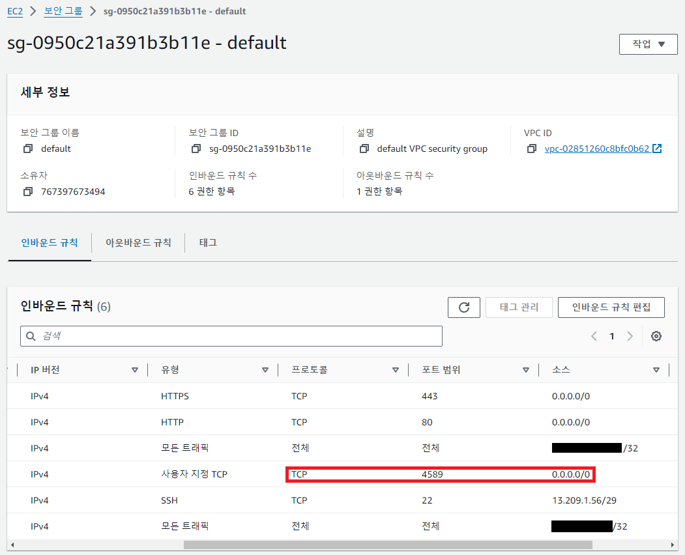

**3줄 요약**

1. t2.micro 인스턴스에서 웹훅 서버를 설정했습니다.
2. GitHub Repository에 push 이벤트가 발생하면 웹훅 서버가 실행 스크립트를 실행합니다.
3. 실행 스크립트는 프로젝트를 다시 빌드하고, pm2로 프로젝트를 재시작합니다.

# 웹훅 서버 구축

# git 설정


# 필요 패키지 준비

## webhook

### GitHub Repository

https://github.com/adnanh/webhook

### 설치 명령어

```
apt install webhook
```

## git

### credential.helper 설정

비밀번호(토큰)을 1회만 입력하면 이를 저장하여 다음에 다시 물어보지 않는다.

```
git config --global credential.helper store
```

## 웹훅 API 및 실행 스크립트

### hooks.json

```
[
	{
		"id": "rebuild",
		"execute-command": "/home/ubuntu/rebuild.sh",
		"command-working-directory": "/home/ubuntu"
	}
]
```

### rebuild.sh

```
#!/bin/bash
# This script is used to rebuild the project
echo "Rebuilding the project..."

# Using webhook to execute the script
# webhook -hooks hooks.json -port 4589 -verbose

```

### 실행 스크립트

```
webhook -hooks hooks.json -port 8080 -verbose
```

## AWS 방화벽 설정

### 보안 그룹 포트 설정

