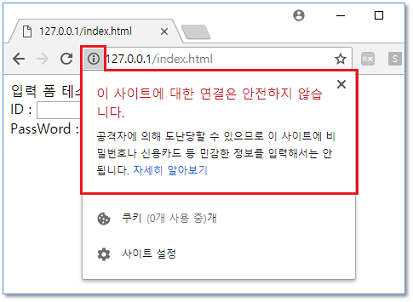
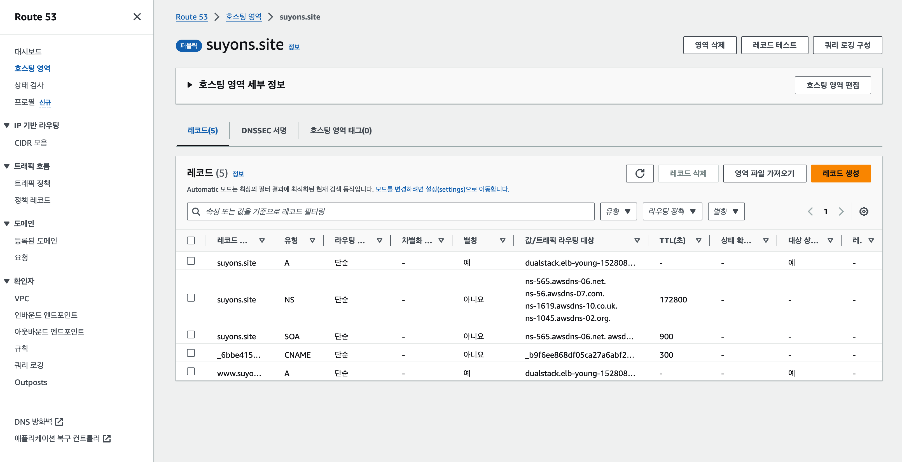
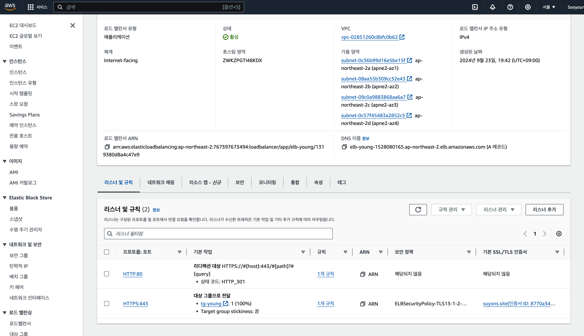
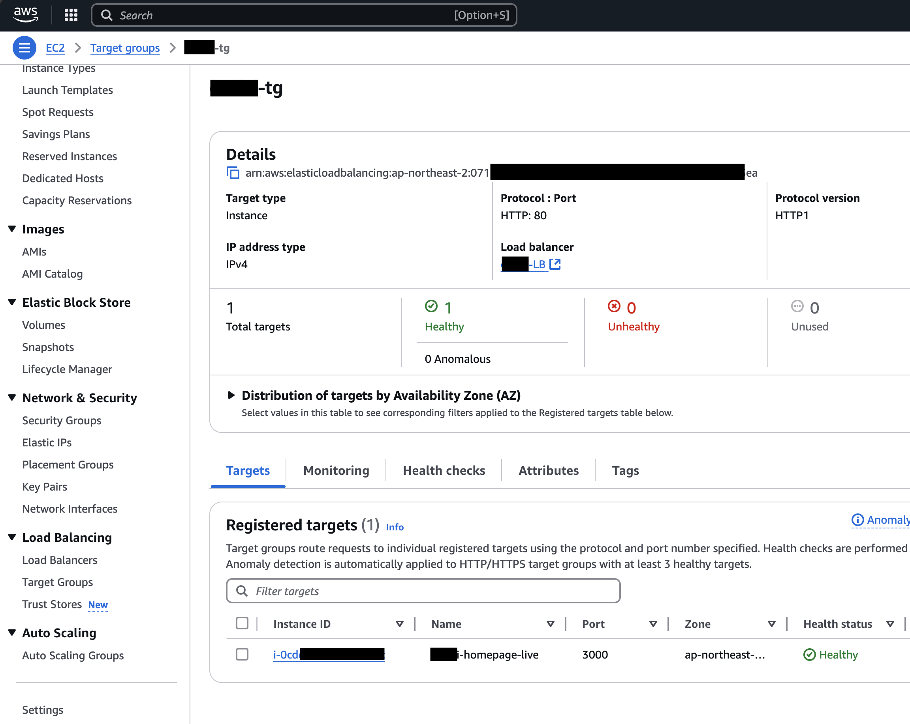
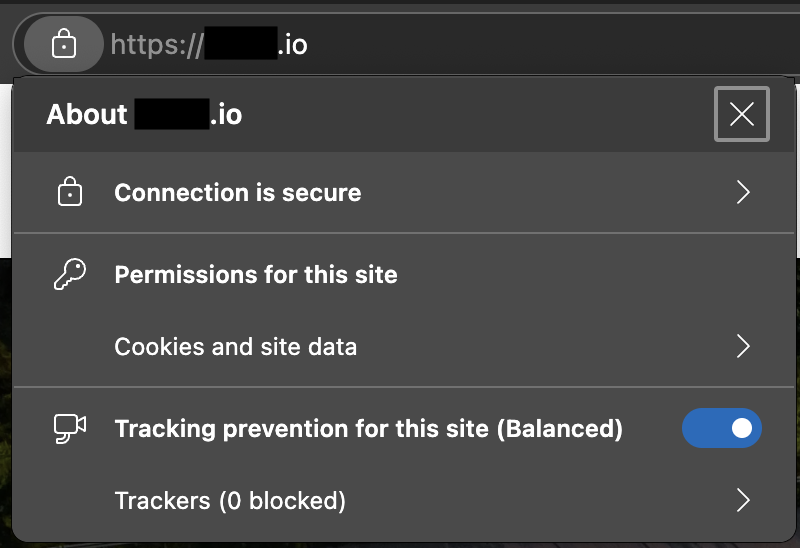

# AWS EC2로 배포하면서 도메인과 HTTPS 적용하기

# 들어가며

## 요약

1. EC2 인스턴스에서 next.js 앱을 실행합니다.
2. 도메인을 구입하고 Route 53을 통해 연결합니다.
3. ACM을 통해 SSL 인증서를 발급받습니다.
4. 로드 밸런서 설정: TCP 443 -> TCP 3000

## 이걸 왜 해야 하나요?

- 우리가 `http://localhost:3000`에서 작업하는 next.js 프로젝트는 언젠가 배포되어야 합니다.
- HTTPS는 현재 웹 서비스에서 필수적인 보안 요소입니다.

# 1. EC2 인스턴스에서 next.js 앱 실행하기

## 1.1. EC2 인스턴스 생성

- AWS Management Console에서 EC2 인스턴스를 생성합니다.

## 1.2. SSH로 접속

- 생성한 EC2 인스턴스에 SSH로 접속합니다.

## 1.3. NVM을 이용한 Node.js 설치

- NVM은 Node Version Manager의 약자로, Node.js의 버전을 관리하는 도구입니다.
- 최신 버전뿐 아니라 이전 버전도 간편하게 설치할 수 있습니다.
- 다음 명령어로 NVM을 설치합니다.

```bash
wget -qO- https://raw.githubusercontent.com/nvm-sh/nvm/v0.40.1/install.sh | bash
source ~/.bashrc
```

- 설치가 완료되면 다음 명령어로 설치된 nvm을 확인합니다.

```bash
nvm --version
```

- 다음 명령어로 Node.js를 설치합니다. 저는 프로젝트의 특성에 따라 18.20.4 버전을 설치했습니다.

```bash
nvm install 18.20.4
```

- 설치가 완료되면 다음 명령어로 설치된 Node.js 버전을 확인합니다.

```bash
node --version
```

## 1.4. PM2를 이용한 next.js 앱 실행

- PM2는 Node.js 앱을 관리하는 프로세스 매니저입니다.
- 다음 명령어로 PM2를 설치합니다.

```bash
npm install pm2 -g
```

- 다음 명령어로 next.js 앱을 실행합니다.

```bash
pm2 start npm --name "next" -- start
```

- 다음 명령어로 실행 중인 프로세스를 확인합니다.

```bash
pm2 list
```

## 1.5 동작 확인

- EC2 인스턴스의 퍼블릭 IP 주소와 포트 번호를 이용하여 next.js 앱이 정상적으로 동작하는지 확인합니다.

- 예를 들어 `http://12.34.56.78:3000/` 주소로 접속합니다.

- 정상적으로 접속된다면 사진과 같이 주소 표시줄에 "안전하지 않음" 경고가 표시됩니다.



# 2. 도메인 구입 및 Route 53 연결

- 다음의 블로그 글에 가비아 도메인 구입부터 Route 53 연결까지 자세히 설명되어 있습니다.

- https://jindevelopetravel0919.tistory.com/189

# 3. ACM을 통해 SSL 인증서 발급받기

- AWS Management Console에서 AWS Certificate Manager을 검색하고 SSL/TLS 인증서를 생성합니다.

- 다음의 블로그 글에 ACM을 통해 SSL 인증서를 발급받는 방법이 자세히 설명되어 있습니다.

- https://pizza301.tistory.com/99

- 저는 해당 블로그 글을 참고하여 이렇게 구성했습니다.



# 4. 로드 밸런서 설정: TCP 443 -> TCP 3000

- 로드 밸런서를 생성하고 리스너를 추가합니다.

- 로드 밸런서의 리스너 설정은 다음과 같이 했습니다.

- HTTP (TCP 80) 요청을 받으면 HTTPS (TCP 443)로 리다이렉트합니다.



- 로드 밸런서의 대상 그룹 설정은 다음과 같이 했습니다.



# 결과

- 이제 `https://domain.com`으로 접속하면 next.js 앱이 실행됩니다.

- 또한 SSL 인증서가 적용되어 "안전하지 않은 사이트" 경고 없이 접속할 수 있습니다.


