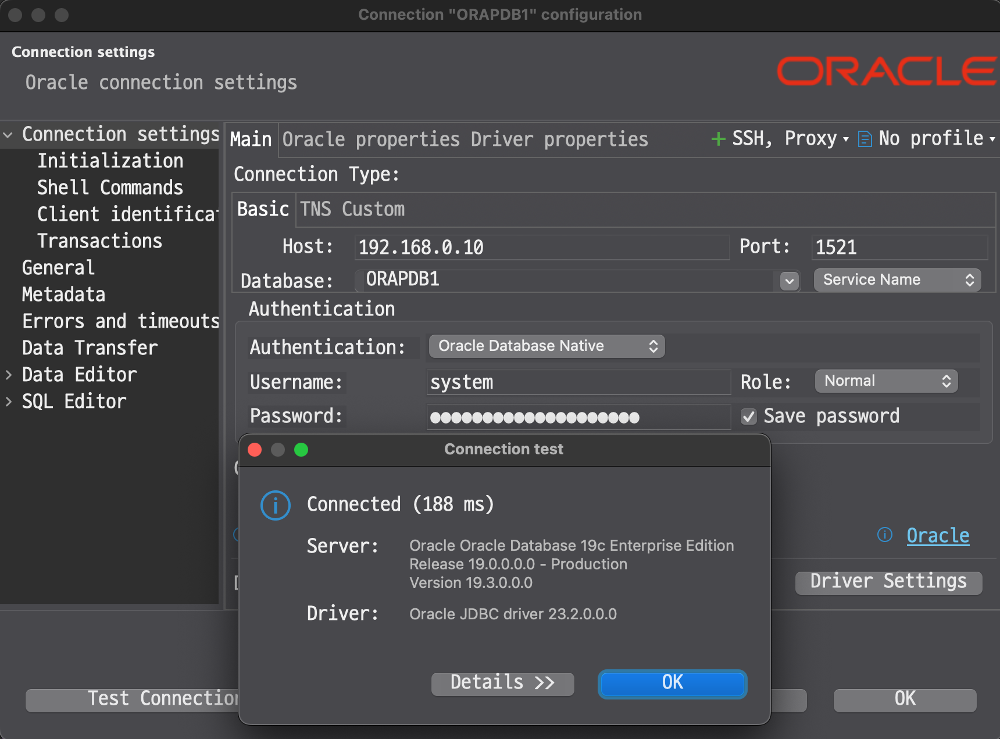

# Ubuntu에서 Oracle Database 19c 설치하기 (Docker)

## Oracle Database 19c 설치 요구사항

- Oracle Database 19c는 **Windows x64** 및 **Red Hat 계열 리눅스 x64** 배포판에서만 설치가 가능합니다.
- Ubuntu 등 기타 리눅스 배포판에서는 공식적으로 지원되지 않습니다.
- Docker 이미지는 지원되는 운영체제 기반에서 생성되어야 합니다.

## 필요 파일 사전 준비

### docker 이미지 생성하기

Oracle에서는 docker 이미지를 직접 제공하지는 않고, Dockerfile과 설치 스크립트만 제공합니다.

[Oracle Database Docker GitHub Repository](https://github.com/oracle/docker-images/tree/main/OracleDatabase/19.3.0)

이를 다운로드합니다.

```bash
git clone https://github.com/oracle/docker-images.git
```

### Oracle Database 설치 파일 다운로드

Oracle Database 19c 설치 파일을 Oracle 공식 사이트에서 다운로드합니다.

[Oracle Database Software Downloads](https://www.oracle.com/database/technologies/oracle19c-linux-downloads.html)

대상 시스템은 `Oracle Database 19c (19.3) for Linux x86-64`이며

다운로드 파일 이름은 `LINUX.X64_193000_db_home.zip` 입니다.

파일을 다운로드한 이후 SCP 등을 이용하여 Ubuntu 서버의 홈 디렉토리로 전송합니다.

```bash
scp LINUX.X64_193000_db_home.zip docker@ubuntu:~
```

## Docker 이미지 생성

다운로드한 파일을 `docker-images/OracleDatabase/19.3.0` 디렉토리로 이동시킵니다.

```bash
mv LINUX.X64_193000_db_home.zip docker-images/OracleDatabase/19.3.0/
```

해당 경로에는 파일이 다음과 같이 있어야 합니다.

```bash
docker@ubuntu:~/docker-images/OracleDatabase/SingleInstance/dockerfiles/19.3.0$ ll
total 2988116
drwxrwxr-x  2 docker docker       4096 Sep 17 19:01 ./
drwxrwxr-x 10 docker docker       4096 Sep 17 18:58 ../
-rwxrwxr-x  1 docker docker       2727 Sep 17 18:58 checkDBStatus.sh*
-rwxrwxr-x  1 docker docker        904 Sep 17 18:58 checkSpace.sh*
-rw-rw-r--  1 docker docker         63 Sep 17 18:58 Checksum.ee
-rw-rw-r--  1 docker docker         65 Sep 17 18:58 Checksum.ee.arm64
-rw-rw-r--  1 docker docker         63 Sep 17 18:58 Checksum.se2
-rw-rw-r--  1 docker docker       7453 Sep 17 18:58 configTcps.sh
-rwxrwxr-x  1 docker docker       9047 Sep 17 18:58 createDB.sh*
-rw-rw-r--  1 docker docker       1567 Sep 17 18:58 createObserver.sh
-rw-rw-r--  1 docker docker       9204 Sep 17 18:58 dbca.rsp.tmpl
-rw-rw-r--  1 docker docker       6878 Sep 17 18:58 db_inst.rsp
-rw-rw-r--  1 docker docker       5077 Sep 17 18:58 Dockerfile
-rwxrwxr-x  1 docker docker       2712 Sep 17 18:58 installDBBinaries.sh*
-rw-rw-r--  1 docker docker 3059705302 Sep 17 18:57 LINUX.X64_193000_db_home.zip
-rw-rw-r--  1 docker docker       2013 Sep 17 18:58 relinkOracleBinary.sh
-rwxrwxr-x  1 docker docker      11283 Sep 17 18:58 runOracle.sh*
-rwxrwxr-x  1 docker docker       1021 Sep 17 18:58 runUserScripts.sh*
-rwxrwxr-x  1 docker docker       1141 Sep 17 18:58 setPassword.sh*
-rwxrwxr-x  1 docker docker       1066 Sep 17 18:58 setupLinuxEnv.sh*
-rwxrwxr-x  1 docker docker        679 Sep 17 18:58 startDB.sh*
```

Docker 이미지를 생성합니다.

```bash
cd docker-images/OracleDatabase/SingleInstance/dockerfiles
./buildContainerImage.sh -v 19.3.0 -e
(생략)
Oracle Database container image for 'ee' version 19.3.0 is ready to be extended:

  --> oracle/database:19.3.0-ee

Build completed in 110 seconds.
```

이미지의 목록을 확인합니다.

```bash
docker@ubuntu:~$ docker images
REPOSITORY        TAG         IMAGE ID       CREATED          SIZE
oracle/database   19.3.0-ee   a4dcf85abc5b   22 minutes ago   6.54GB
```

## Docker 컨테이너 생성 및 실행

컨테이너를 생성하고 실행합니다.

```bash
docker run --name oracle19c -p 1521:1521 -p 5500:5500 \
-e ORACLE_PDB=orapdb1 \
-e ORACLE_PWD='YOUR_PASSWORD_HERE!' \
-e ORACLE_MEM=3000 \
-v /opt/oracle/oradata:/opt/oracle/oradata \
-d oracle/database:19.3.0-ee
```

### 파라미터 설명

- `--name oracle19c` : 컨테이너 이름 지정
- `-p 1521:1521` : 호스트의 1521 포트를 컨테이너의 1521 포트에 매핑 (Oracle Listener)
- `-p 5500:5500` : 호스트의 5500 포트를 컨테이너의 5500 포트에 매핑 (Enterprise Manager Express)
- `-e ORACLE_PDB=orapdb1` : 생성할 PDB 이름 지정, 이는 곧 접속할 SID가 됩니다. 예시로 `orapdb1` 사용
- `-e ORACLE_PWD='YOUR_PASSWORD_HERE!'` : Oracle 시스템 사용자 비밀번호 설정 (특수문자 포함 시 홑따옴표 사용)
- `-e ORACLE_MEM=3000` : 컨테이너에 할당할 메모리 크기 (MB 단위)
- `-v /opt/oracle/oradata:/opt/oracle/oradata` : 호스트의 디렉토리를 컨테이너의 데이터 저장소로 마운트
- `-d` : 백그라운드 실행
- `oracle/database:19.3.0-ee` : 사용할 Docker 이미지

컨테이너가 정상적으로 실행 중인지 확인합니다.

```bash
docker@ubuntu:~$ docker ps
CONTAINER ID   IMAGE                       COMMAND                  CREATED              STATUS                                 PORTS                                                                                      NAMES
cba62376dcd2   oracle/database:19.3.0-ee   "/bin/bash -c 'exec …"   About a minute ago   Up About a minute (health: starting)   0.0.0.0:1521->1521/tcp, [::]:1521->1521/tcp, 0.0.0.0:5500->5500/tcp, [::]:5500->5500/tcp   oracle19c
```

### 초기 실행 오류에 대한 트러블슈팅

컨테이너의 로그를 확인하여 Oracle Database가 정상적으로 시작되었는지 확인합니다.

```bash
diredocker@ubuntu:~$ docker logs -f oracle19c
ORACLE EDITION: ENTERPRISE

LSNRCTL for Linux: Version 19.0.0.0.0 - Production on 17-SEP-2025 12:41:01

Copyright (c) 1991, 2019, Oracle.  All rights reserved.

# ... 중간 생략 ...

SQL> SQL> Disconnected from Oracle Database 19c Enterprise Edition Release 19.0.0.0.0 - Production
Version 19.3.0.0.0
ORACLE_HOME = [/home/oracle] ? ORACLE_BASE environment variable is not being set since this
information is not available for the current user ID .
You can set ORACLE_BASE manually if it is required.
Resetting ORACLE_BASE to its previous value or ORACLE_HOME
The Oracle base remains unchanged with value /opt/oracle
/opt/oracle/checkDBStatus.sh: line 26: sqlplus: command not found
mkdir: cannot create directory '/opt/oracle/oradata/dbconfig': Permission denied
mv: cannot stat '/opt/oracle/product/19c/dbhome_1/dbs/spfileORCLCDB.ora': No such file or directory
mv: cannot stat '/opt/oracle/product/19c/dbhome_1/dbs/orapwORCLCDB': No such file or directory
mv: cannot move '/opt/oracle/product/19c/dbhome_1/network/admin/sqlnet.ora' to '/opt/oracle/oradata/dbconfig/ORCLCDB/': No such file or directory
mv: cannot move '/opt/oracle/product/19c/dbhome_1/network/admin/listener.ora' to '/opt/oracle/oradata/dbconfig/ORCLCDB/': No such file or directory
mv: cannot move '/opt/oracle/product/19c/dbhome_1/network/admin/tnsnames.ora' to '/opt/oracle/oradata/dbconfig/ORCLCDB/': No such file or directory
mv: cannot move '/opt/oracle/product/19c/dbhome_1/install/.docker_enterprise' to '/opt/oracle/oradata/dbconfig/ORCLCDB/': No such file or directory
cp: cannot create regular file '/opt/oracle/oradata/dbconfig/ORCLCDB/': No such file or directory
ln: failed to create symbolic link '/opt/oracle/product/19c/dbhome_1/network/admin/sqlnet.ora': File exists
ln: failed to create symbolic link '/opt/oracle/product/19c/dbhome_1/network/admin/listener.ora': File exists
ln: failed to create symbolic link '/opt/oracle/product/19c/dbhome_1/network/admin/tnsnames.ora': File exists
cp: cannot stat '/opt/oracle/oradata/dbconfig/ORCLCDB/oratab': No such file or directory
ORACLE_HOME = [/home/oracle] ? ORACLE_BASE environment variable is not being set since this
information is not available for the current user ID .
You can set ORACLE_BASE manually if it is required.
Resetting ORACLE_BASE to its previous value or ORACLE_HOME
The Oracle base remains unchanged with value /opt/oracle
/opt/oracle/checkDBStatus.sh: line 26: sqlplus: command not found
#####################################
########### E R R O R ###############
DATABASE SETUP WAS NOT SUCCESSFUL!
Please check output for further info!
########### E R R O R ###############
#####################################
```

로그에 오류가 다수 발생한 것을 확인할 수 있습니다.
컨테이너 내부에 접속하여 Oracle Database 상태를 확인합니다.

```bash
docker@ubuntu:~$ docker exec -it oracle19c bash
bash-4.2$ sqlplus / as sysdba

SQL*Plus: Release 19.0.0.0.0 - Production on Wed Sep 17 12:47:29 2025
Version 19.3.0.0.0

Copyright (c) 1982, 2019, Oracle.  All rights reserved.


Connected to:
Oracle Database 19c Enterprise Edition Release 19.0.0.0.0 - Production
Version 19.3.0.0.0

SQL>
```

Oracle Database에 접속된 것을 확인할 수 있습니다. 그러나 데이터베이스가 열리지 않은 상태입니다.

```sql
SQL> select status from v$instance;

STATUS
------------
MOUNTED
```

데이터베이스를 열어줍니다.

```sql
SQL> alter database open;
alter database open
*
ERROR at line 1:
ORA-00210: cannot open the specified control file
ORA-00202: control file: '/opt/oracle/cfgtoollogs/dbca/ORCLCDB/tempControl.ctl'
ORA-27041: unable to open file
Linux-x86_64 Error: 2: No such file or directory
Additional information: 3
```

오류 메시지에 따라 컨트롤 파일이 없다는 것을 알 수 있습니다.
Ctrl + D를 눌러 SQLPlus를 종료한 후,
컨테이너 내부에서 `/opt/oracle/oradata` 디렉토리의 권한을 확인합니다.

```bash
bash-4.2$ ls -l /opt/oracle
total 116
drwxr-x--- 3 oracle oinstall  4096 Sep 17 12:41 admin
drwxr-x--- 2 oracle oinstall  4096 Sep 17 12:41 audit
drwxr-x--- 3 oracle oinstall  4096 Sep 17 12:41 cfgtoollogs
-rwxrwxr-x 1 oracle dba       2727 Sep 17 09:58 checkDBStatus.sh
drwxr-xr-x 2 oracle dba       4096 Sep 17 10:02 checkpoints
-rwxrwxr-- 1 oracle dba       7453 Sep 17 09:58 configTcps.sh
-rwxrwxr-x 1 oracle dba       9047 Sep 17 09:58 createDB.sh
-rwxrwxr-- 1 oracle dba       1567 Sep 17 09:58 createObserver.sh
-rw-rw-r-- 1 oracle dba       9204 Sep 17 09:58 dbca.rsp.tmpl
drwxrwxr-x 1 oracle dba       4096 Sep 17 10:02 diag
drwxrwx--- 1 oracle dba       4096 Sep 17 12:41 oraInventory
drwxr-xr-x 2 root   root      4096 Sep 17 10:31 oradata
drwxr-xr-x 1 oracle dba       4096 Sep 17 10:01 product
-rwxrwxr-- 1 oracle dba       2013 Sep 17 09:58 relinkOracleBinary.sh
-rwxrwxr-x 1 oracle dba      11283 Sep 17 09:58 runOracle.sh
-rwxrwxr-x 1 oracle dba       1021 Sep 17 09:58 runUserScripts.sh
drwxr-xr-x 1 oracle dba       4096 Sep 17 10:01 scripts
-rwxrwxr-x 1 oracle dba       1141 Sep 17 09:58 setPassword.sh
-rwxrwxr-x 1 oracle dba        679 Sep 17 09:58 startDB.sh
```

`/opt/oracle/oradata` 디렉토리가 `root:root` 소유로 되어 있어 Oracle 프로세스가 접근할 수 없습니다.
컨테이너 내부에서 `/opt/oracle/oradata` 디렉토리의 소유자를 `oracle:dba`로 변경합니다.

```bash
bash-4.2$ chown -R oracle:dba /opt/oracle/oradata
chown: changing ownership of '/opt/oracle/oradata': Operation not permitted
```

권한 변경이 실패하는 경우, 호스트에서 권한을 변경한 후 컨테이너를 재시작합니다.
여기에서 `54321:54322`는 `oracle:dba` 사용자의 UID:GID입니다.

```bash
docker@ubuntu:~$ sudo chown -R 54321:54322 /opt/oracle/oradata
[sudo] password for docker:
docker@ubuntu:~$ docker restart oracle19c
oracle19c
```

컨테이너가 정상적으로 실행 중인지 다시 확인합니다.

```bash
docker@ubuntu:~$ docker ps
CONTAINER ID   IMAGE                       COMMAND                  CREATED          STATUS                             PORTS                                                                                      NAMES
cba62376dcd2   oracle/database:19.3.0-ee   "/bin/bash -c 'exec …"   11 minutes ago   Up 19 seconds (health: starting)   0.0.0.0:1521->1521/tcp, [::]:1521->1521/tcp, 0.0.0.0:5500->5500/tcp, [::]:5500->5500/tcp   oracle19c
```

컨테이너의 로그를 다시 확인합니다.

```bash
docker@ubuntu:~$ docker logs -f oracle19c
ORACLE EDITION: ENTERPRISE

LSNRCTL for Linux: Version 19.0.0.0.0 - Production on 17-SEP-2025 12:41:01

Copyright (c) 1991, 2019, Oracle.  All rights reserved.

# ... 중간 생략 ...

#########################
DATABASE IS READY TO USE!
#########################
The following output is now a tail of the alert.log:
ORAPDB1(3):
ORAPDB1(3):XDB initialized.
2025-09-17T13:04:29.860628+00:00
ALTER SYSTEM SET control_files='/opt/oracle/oradata/ORCLCDB/control01.ctl' SCOPE=SPFILE;
2025-09-17T13:04:29.869751+00:00
ALTER SYSTEM SET local_listener='' SCOPE=BOTH;
   ALTER PLUGGABLE DATABASE ORAPDB1 SAVE STATE
Completed:    ALTER PLUGGABLE DATABASE ORAPDB1 SAVE STATE

XDB initialized.
```

오류 메시지가 사라지고 데이터베이스가 정상적으로 생성 및 시작된 것을 확인할 수 있습니다.

컨테이너 내부에 접속하여 데이터베이스 상태를 다시 확인합니다.

```bash
docker@ubuntu:~$ docker exec -it oracle19c bash
bash-4.2$ sqlplus / as sysdba

SQL*Plus: Release 19.0.0.0.0 - Production on Wed Sep 17 13:09:08 2025
Version 19.3.0.0.0

Copyright (c) 1982, 2019, Oracle.  All rights reserved.


Connected to:
Oracle Database 19c Enterprise Edition Release 19.0.0.0.0 - Production
Version 19.3.0.0.0

SQL>
```

Oracle Database에 접속된 것을 확인할 수 있습니다.

```sql
SQL> select status from v$instance;

STATUS
------------
OPEN
```

데이터베이스가 OPEN 상태인 것을 확인할 수 있습니다.

```sql
SQL> select name, open_mode from v$pdbs;

NAME
--------------------------------------------------------------------------------
OPEN_MODE
----------
PDB$SEED
READ ONLY

ORAPDB1
READ WRITE
```

생성한 PDB가 정상적으로 OPEN된 것을 확인할 수 있습니다.

## Oracle Database 접속 테스트

DBeaver, SQL Developer와 같은 GUI 클라이언트를 이용하여 Oracle Database에 접속합니다.

접속 정보는 다음과 같습니다.

- 호스트: Ubuntu 서버의 IP 주소
- 포트: 1521
- 서비스 이름: ORAPDB1
- 사용자 이름: SYSTEM
- 비밀번호: 컨테이너 생성 시 설정한 비밀번호



접속이 정상적으로 이루어지는 것을 확인할 수 있습니다.
여기까지 Docker 환경에 Oracle 19c를 설치하고 PDB를 생성하는 과정을 알아보았습니다.
지금부터 사용자, 스키마, 테이블을 생성하면 바로 서비스를 시작할 수 있습니다.
이후의 내용은 Oracle Database 관리에 대한 추가적인 내용입니다.

## PDB 관리

### PDB 이름 변경

혹시 PDB 이름을 변경해야 하는 경우, 다음 절차를 따릅니다.

1. PDB를 닫습니다:

```sql
ALTER PLUGGABLE DATABASE ORAPDB1 CLOSE;
```

2. PDB를 RESTRICTED 모드로 엽니다:

```sql
ALTER PLUGGABLE DATABASE ORAPDB1 OPEN RESTRICTED;
```

3. PDB의 이름을 변경합니다:

```sql
ALTER PLUGGABLE DATABASE ORAPDB1 RENAME GLOBAL_NAME TO NEW_PDB_NAME;
```

4. PDB를 닫고 다시 엽니다:

```sql
ALTER PLUGGABLE DATABASE NEW_PDB_NAME CLOSE;
ALTER PLUGGABLE DATABASE NEW_PDB_NAME OPEN;
```

이름 변경 후 PDB 상태를 확인합니다:

```sql
SELECT name, open_mode FROM v$pdbs;
```

### PDB 생성

새로운 PDB를 생성하려면 다음 명령을 사용합니다:

```sql
CREATE PLUGGABLE DATABASE newpdb ADMIN USER pdbadmin IDENTIFIED BY "password!";
```

- 비밀번호 따옴표 사용: 특수문자가 포함된 경우 bash 쉘에서는 홑따옴표, SQLPlus에서는 쌍따옴표를 사용합니다.

### PDB 삭제

PDB를 삭제하려면 다음 명령을 사용합니다:

```sql
ALTER PLUGGABLE DATABASE pdbname CLOSE;
DROP PLUGGABLE DATABASE pdbname INCLUDING DATAFILES;
```

### PDB 열기/닫기

PDB를 열거나 닫으려면:

```sql
-- PDB 열기
ALTER PLUGGABLE DATABASE pdbname OPEN;

-- PDB 닫기
ALTER PLUGGABLE DATABASE pdbname CLOSE;
```

# 덤프 파일을 이용한 데이터 이동

저는 이전에 다른 서버에서 Oracle 19c를 사용하고 있었습니다.
덤프 파일을 만들고 현재 Docker 컨테이너의 Oracle Database로 복원해보겠습니다.

## 덤프 파일 준비

이전 서버에서 expdp 명령을 사용하여 덤프 파일을 생성합니다.
파일이 생성되면 Ubuntu 호스트의 홈 디렉토리로 전송합니다.

```bash
[oracle@localhost ~]$ expdp USERNAME/'PASSWORD!'@PDB_NAME schemas=SCHEMA_NAME directory=DATA_PUMP_DIR dumpfile=dumpfile.dmp logfile=export.log

Export: Release 19.0.0.0.0 - Production on Wed Sep 17 23:12:11 2025
Version 19.3.0.0.0

Copyright (c) 1982, 2019, Oracle and/or its affiliates.  All rights reserved.

Connected to: Oracle Database 19c Enterprise Edition Release 19.0.0.0.0 - Production

# ... 중간 생략 ...

Dump file set for SYSTEM.SYS_EXPORT_SCHEMA_01 is:
  /opt/oracle/admin/ORCLCDB/dpdump/3C90128E12098EEFE065000000000001/dumpfile.dmp
Job "SYSTEM"."SYS_EXPORT_SCHEMA_01" successfully completed at Wed Sep 17 23:12:44 2025 elapsed 0 00:00:33
```

## 덤프 파일 이동

Docker 컨테이너에서 덤프 파일을 읽을 수 있도록 준비합니다.
impdp에서 사용하는 디렉토리를 알아내기 위해 컨테이너에 접속하여 확인합니다.

```bash
bash-4.2$ sqlplus system/'MY_PASSWORD_HERE!'

SQL*Plus: Release 19.0.0.0.0 - Production on Wed Sep 17 14:33:33 2025
Version 19.3.0.0.0

Copyright (c) 1982, 2019, Oracle.  All rights reserved.

Last Successful login time: Wed Sep 17 2025 13:15:59 +00:00

Connected to:
Oracle Database 19c Enterprise Edition Release 19.0.0.0.0 - Production
Version 19.3.0.0.0

SQL> SHOW CON_NAME;

CON_NAME
------------------------------
ORAPDB1
SQL>SELECT directory_name, directory_path FROM dba_directories WHERE directory_name = 'DATA_PUMP_DIR';

DIRECTORY_NAME
--------------------------------------------------------------------------------
DIRECTORY_PATH
--------------------------------------------------------------------------------
DATA_PUMP_DIR
/opt/oracle/admin/ORCLCDB/dpdump/3F009C70B6160238E063020011AC8843
```

Ubuntu 호스트의 홈 디렉토리에서 덤프 파일을 컨테이너의 `DATA_PUMP_DIR` 경로로 복사합니다.

```bash
docker cp ~/dumpfile.dmp oracle19c:/opt/oracle/admin/ORCLCDB/dpdump/3F009C70B6160238E063020011AC8843/
Successfully copied 245MB to oracle19c:/opt/oracle/admin/ORCLCDB/dpdump/3F009C70B6160238E063020011AC8843/
```

## 테이블스페이스 생성하기

기존에 사용하던 테이블스페이스를 생성해야 덤프 파일을 불러올 수 있습니다.
기존의 테이블스페이스 이름이 `USERS_DATA`라고 가정하겠습니다.

```sql
SQL> CREATE TABLESPACE USERS_DATA
DATAFILE '/opt/oracle/oradata/ORCLCDB/ORAPDB1/users_data01.dbf'
SIZE 100M AUTOEXTEND ON NEXT 50M MAXSIZE UNLIMITED;

Tablespace created.
```

## 덤프 파일 불러오기

컨테이너에 접속하여 impdp 명령을 사용하여 덤프 파일을 불러옵니다.

```bash
docker@ubuntu:~$ docker exec -it oracle19c bash
bash-4.2$ impdp system/'MY_PASSWORD_HERE!' schemas=SCHEMA_NAME directory=DATA_PUMP_DIR dumpfile=dumpfile.dmp logfile=import.log

Import: Release 19.0.0.0.0 - Production on Wed Sep 17 14:49:45 2025
Version 19.3.0.0.0

Copyright (c) 1982, 2019, Oracle and/or its affiliates.  All rights reserved.

Connected to: Oracle Database 19c Enterprise Edition Release 19.0.0.0.0 - Production
Master table "SYSTEM"."SYS_IMPORT_SCHEMA_01" successfully loaded/unloaded

# ... 중간 생략 ...

Job "SYSTEM"."SYS_IMPORT_SCHEMA_01" completed with 1 error(s) at Wed Sep 17 14:49:51 2025 elapsed 0 00:00:06
```

이렇게 덤프 파일을 불러오는 과정을 마쳤습니다.

## 참고 자료

- [Oracle Database Docker GitHub Repository](https://github.com/oracle/docker-images/tree/main/OracleDatabase)
- [Oracle Database Software Downloads](https://www.oracle.com/database/technologies/oracle19c-linux-downloads.html)
- [Oracle Database 19c Documentation](https://docs.oracle.com/en/database/oracle/oracle-database/19/index.html)
